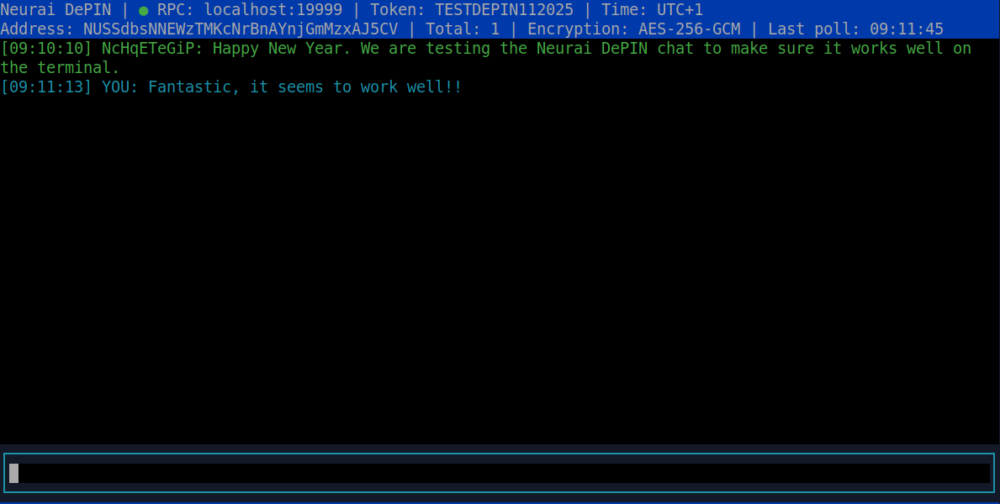
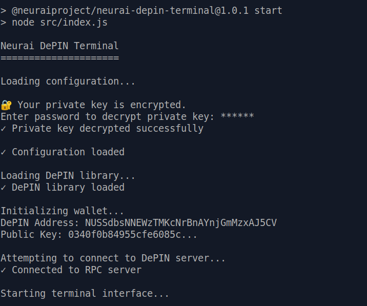
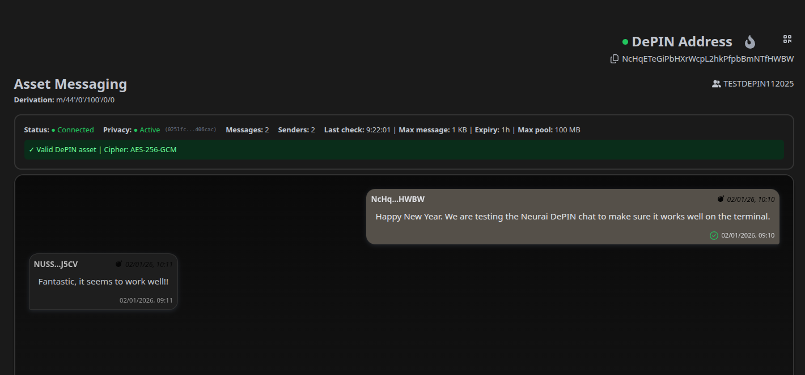

# Neurai DePIN Terminal

Terminal client for Neurai DePIN messaging with full-screen interface.

<div align="center"></div>

## Features

- ✅ Full-screen terminal interface with blessed
- ✅ Simple configuration via `config.json`
- ✅ **Encrypted private key storage** with AES-256-GCM encryption
- ✅ Automatic broadcast to all token holders
- ✅ Full support for server privacy layer (`depinpoolpkey`)
- ✅ Automatic polling every 10 seconds (configurable)
- ✅ Proper message deduplication
- ✅ Robust error handling and reconnection

## Requirements

- Node.js v22 or higher
- A DePIN token on the Neurai network
- WIF private key of an address that owns the token
- Access to a Neurai DePIN RPC server

## Installation

### Install from npm

```bash
npm install -g @neuraiproject/neurai-depin-terminal
```

Then run:

```bash
neurai-depin-terminal
```

```bash
cd docs/neurai-depin-client
npm install
```

## Configuration

When you run the application for the first time, an interactive wizard will start and create the `config.json` file:

```bash
npm start
```

<div align="center"></div>

The wizard will ask you for:

1. **RPC Server**: DePIN RPC server URL (required)
2. **RPC Username**: RPC username (optional, leave empty if not required)
3. **RPC Password**: RPC password (optional, leave empty if not required)
4. **DePIN Token**: Asset name (any valid Neurai asset)
5. **Private Key**: Your private key in WIF format
6. **Encryption Password**: Password to encrypt your private key (4-30 characters, required)
7. **Polling Interval**: Interval in milliseconds to check for new messages (default: 10000)

**Important:** Your private key will be encrypted with AES-256-GCM using the password you provide. You will need to enter this password every time you start the application. The decrypted key is kept in memory only and never saved unencrypted.

### Example config.json

```json
{
  "rpc_url": "https://rpc-depin.neurai.org",
  "rpc_username": "",
  "rpc_password": "",
  "token": "MYTOKEN",
  "privateKey": "a1b2c3...encrypted_data...xyz789",
  "network": "xna",
  "pollInterval": 10000
}
```

**Note:** The `privateKey` field contains the encrypted private key in the format `salt:iv:authTag:encrypted` (all in hex, colon-separated). This is automatically created by the wizard when you provide your encryption password.

**Note:** The `/rpc` path is automatically appended by the application, so just provide the base URL (e.g., `https://rpc-depin.neurai.org` or `https://rpc-depin.neurai.org:19001`).

## Usage

Once configured, simply run:

```bash
npm start
```

### Building Binaries

You can create standalone executables for Linux, macOS, and Windows:

```bash
npm run build
```

The binaries will be generated in the `bin/` directory. This allows you to run the application without having Node.js installed on the target machine.

**Note:** The build process uses `esbuild` to bundle the source code and `pkg` to create the executables.

### Password Prompt: On startup, you will be prompted to enter your encryption password to decrypt the private key. You have 3 attempts. If all attempts fail, the application will exit.

### Interface

The application will display a full-screen interface with:

```
┌────────────────────────────────────────────────────────────┐
│ Neurai DePIN | RPC: localhost:19001 | ● Connected          │
│ Token: MYTOKEN | NXXXabc...xyz | Last poll: 10:23:45       │
├────────────────────────────────────────────────────────────┤
│                                                            │
│ [10:20:15] NXXXdef...123: Hello world                      │
│ [10:21:32] NXXXghi...456: Testing DePIN messaging          │
│ [10:22:18] YOU: This is my message                         │
│                                                            │
│                                                            │
├────────────────────────────────────────────────────────────┤
│ > Type message... (Enter: Send | Ctrl+C: Quit)             │
└────────────────────────────────────────────────────────────┘
```

<div align="center"></div>


<div align="center"></div>


**Components:**

- **Top bar**: Shows RPC connection status, configured token, address and last poll time
- **Message area**: Shows received and sent messages (scrollable with arrow keys)
- **Input area**: Type your message here

### Keyboard Shortcuts

- **Enter** or **Ctrl+S**: Send message
- **Ctrl+C** or **Escape**: Exit application
- **Up/Down arrows**: Scroll in message area

## How It Works

1. **Startup**: Application loads configuration and connects to RPC server
2. **Polling**: Every 10 seconds (configurable) checks for new messages in the DePIN pool
3. **Reception**: Messages are automatically decrypted and displayed on screen
4. **Sending**: When pressing Ctrl+S, the message is sent to **all token holders** (broadcast)
5. **Privacy**: If the server has a privacy layer configured (`depinpoolpkey`), messages are additionally encrypted

## Architecture

```
src/
├── index.js                    # Main entry point
├── config/
│   └── ConfigManager.js        # Configuration management + wizard
├── wallet/
│   └── WalletManager.js        # WIF derivation + RPC client
├── messaging/
│   ├── MessageStore.js         # Message deduplication
│   ├── MessagePoller.js        # Automatic polling
│   └── MessageSender.js        # Broadcast sending
├── ui/
│   └── TerminalUI.js           # Blessed interface
└── lib/
    └── depinMsgLoader.js       # IIFE bundle loader
```

## Troubleshooting

### Error: "neurai-depin-msg bundle not found"

Run `npm install` to install dependencies.

### Error: "Error connecting to RPC"

Verify that:
- The RPC server is accessible
- The URL in `config.json` is correct
- Credentials (username/password) are correct if the server requires them

### I'm not receiving messages

Verify that:
- Your address owns the configured DePIN token
- Other token holders exist with revealed public keys
- The RPC server supports DePIN methods (`depinreceivemsg`, `depinsubmitmsg`)

### Error: "No recipients found with revealed public key"

For others to receive your messages, they must have revealed their public key. This is done through a special transaction to the burn address or via the corresponding RPC command.

## Security

- **Private key storage**: Your WIF private key is encrypted with AES-256-GCM using a password-derived key (scrypt with 32-byte salt). The encrypted private key is stored in `config.json` in the format `salt:iv:authTag:encrypted`. The decrypted key is only kept in memory during runtime and is never saved unencrypted to disk.
- **Password requirements**: Encryption password must be between 4 and 30 characters. You have 3 attempts to enter the correct password on startup.
- **Private key usage**: Your private key is never sent to the server. It's only used locally to sign and decrypt messages.
- **Message encryption**: Messages are encrypted with ECIES (Elliptic Curve Integrated Encryption Scheme) before being sent.
- **Privacy layer**: If enabled, adds an additional encryption layer using the server pool's public key.

## License

MIT
